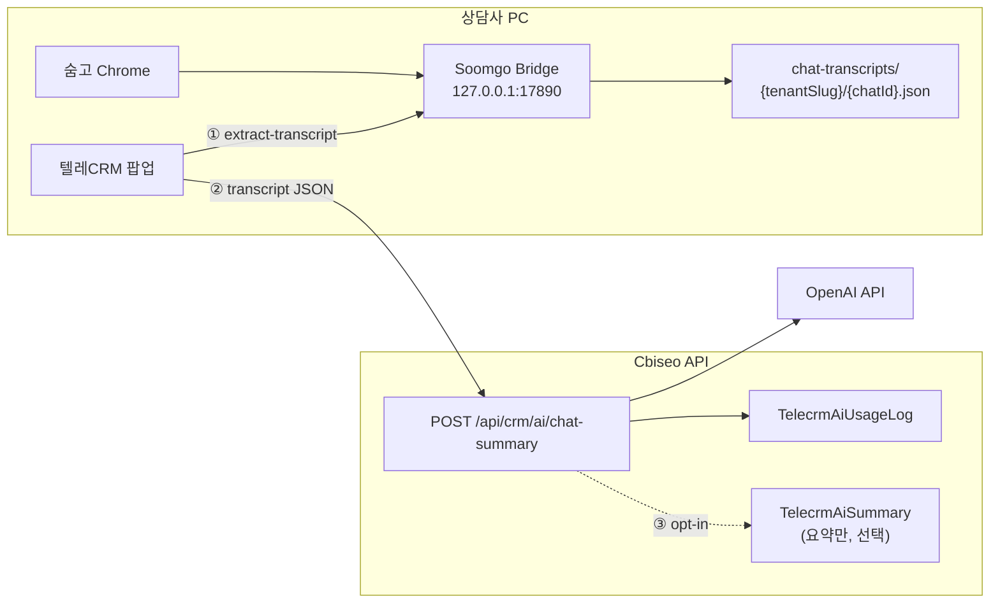

# 텔레CRM · AI 대화 정리 — 전체 구현 플랜

> **목표:** 숨고(추후 미소) 채팅방 **전체 대화**를 PC에서 수집·보관하고, CRM **스크립트 탭형 UI**에서 「AI 정리」로 요약·액션·답장 초안을 받는다.  
> **원칙:** 원문은 **PC 로컬**, AI 호출·과금·(선택) 팀 기억은 **서버**. **로컬에서 기능 전부 검증 후** staging → production 배포.

관련: `docs/TELECRM.md` · `docs/SOOMGO_BRIDGE_CRM_EXTRACT.md` · Quick Paste AI 참고 `server/src/modules/quick-paste/`

---

## 1. 배경 · 현재 한계

| 항목 | 현재 | AI 정리에 필요 |
|------|------|----------------|
| 브릿지 `/extract` | 접수용, 고객 메시지 **최근 12개** | 방 **전체** 대화 |
| DOM 수집 | 보이는 `li`만 | 채팅방 **위로 스크롤** 후 전량 |
| 저장 | DB 없음, CRM은 실시간 추출 | **PC 로컬 JSON** 캐시 |
| AI | Quick Paste만 OpenAI | CRM 전용 **요약 API** |
| UI | `CrmScriptPanel` 탭형 스크립트 | 동일 패턴 **「AI 정리」** 탭 |

---

## 2. 목표 아키텍처



### 역할 분담

| 계층 | 책임 | 저장 |
|------|------|------|
| **브릿지** | 전체 스크롤·파싱·로컬 read/write·CRM용 HTTP | `%LOCALAPPDATA%\Cbiseo\SoomgoBridge\chat-transcripts\` |
| **CRM UI** | 「대화 가져오기」「AI 정리」·탭·결과 표시 | 브라우저 state만 (원문 미보관) |
| **서버** | OpenAI 호출·`tenantId` 격리·사용량·(선택) 요약 영구 저장 | DB는 **요약·메타** 위주, 원문 기본 **비저장** |
| **학습(RAG, 후속)** | 업체별 우수 답변·태그 | `tenantId` 스코프, 원문 X |

### 로컬 JSON 스키마 (초안)

```json
{
  "version": 1,
  "tenantSlug": "cbiseo",
  "chatId": "12345678",
  "nickname": "홍길동",
  "extractedAt": "2026-08-15T12:00:00+09:00",
  "messageCount": 42,
  "messages": [
    { "role": "customer", "text": "...", "at": "2026-08-14T10:01:00+09:00" },
    { "role": "pro", "text": "...", "at": null }
  ],
  "requestPairs": [],
  "contentHash": "sha256:..."
}
```

- **갱신:** 같은 `chatId` 재추출 시 `contentHash` 비교 → 변경 시만 덮어쓰기.
- **보관:** 기본 90일 LRU 또는 폴더 용량 상한(예: 500MB) — Phase 1에서 단순 TTL부터.

---

## 3. UI (스크립트 패널 확장)

**위치:** CRM 중앙 열 `CrmScriptPanel` 영역 — 상단 세그먼트:

| 세그먼트 | 내용 |
|----------|------|
| **스크립트** | 기존 (`CrmScriptPanel`) |
| **AI 정리** | 신규 (`CrmAiSummaryPanel`) |

**AI 정리 탭 UX**

1. 상태: `미수집` / `로컬 N건 (날짜)` / `추출 중` / `정리 중`
2. **「대화 가져오기」** → 브릿지 `POST /extract-transcript` (현재 열린 숨고 방)
3. **「AI 정리」** → 서버 API (로컬 JSON body 또는 브릿지 `GET` 후 전달)
4. 결과 카드: **한 줄 요약 · 고객 핵심 질문 · 다음 액션 · (선택) 답장 초안**
5. **「복사」** · (후속) **「이 답변 저장」** → RAG용 서버 저장
6. 하단: `이번 달 AI N회` (서버 usage)

**브릿지 미연결:** 기존 숨고 연동 차단 메시지와 동일 패턴.

---

## 4. 서버 API (초안)

### `POST /api/crm/ai/chat-summary`

- **가드:** `authMiddleware` · `requireTenantAuth` · `requireFeature('mod_telecrm')` · `requireTelecrmUserAccess`
- **Body:**
  ```ts
  {
    source: 'soomgo',
    chatId: string,
    inquiryId?: string,
    customerName?: string,
    messages: Array<{ role: 'customer' | 'pro' | 'system'; text: string; at?: string | null }>,
    contentHash?: string,
    persistSummary?: boolean  // default false — true면 TelecrmAiSummary 저장
  }
  ```
- **Response:**
  ```ts
  {
    summary: string,
    customerQuestions: string[],
    nextActions: string[],
    suggestedReply?: string,
    warnings?: string[],
    usage: { promptTokens: number; completionTokens: number; model: string }
  }
  ```
- **Side effect:** `TelecrmAiUsageLog` (tenantId, userId, chatId, tokens, model, createdAt)
- **OpenAI:** `gpt-4o-mini` 기본, env `TELECRM_AI_OPENAI_API_KEY` 또는 `OPENAI_API_KEY` (Quick Paste와 분리 가능)

### Prisma (Phase 3)

```prisma
model TelecrmAiUsageLog {
  id           String   @id @default(uuid())
  tenantId     String
  userId       String
  chatId       String?
  inquiryId    String?
  source       String   // soomgo | miso
  model        String
  promptTokens Int
  completionTokens Int
  createdAt    DateTime @default(now())
  @@index([tenantId, createdAt])
}

model TelecrmAiSummary {
  id           String   @id @default(uuid())
  tenantId     String
  userId       String
  chatId       String
  inquiryId    String?
  contentHash  String?
  summary      String
  payloadJson  Json     // structured fields
  createdAt    DateTime @default(now())
  @@unique([tenantId, chatId, contentHash])
  @@index([tenantId, inquiryId])
}
```

- **원문 `messages[]`는 DB에 넣지 않음** (기본). RAG Phase에서도 요약·구조화 필드만.

### 사용량 · 과금 (Phase 5, 배포 전 협의)

- v1: **로그만** + 플랫폼 집계 화면 (Quick Paste AI 패턴)
- v2: 테넌트 **월 N회 한도** 또는 **코인 차감** (`TenantCoinLedgerEntry` reason `crm_ai_summary`)

---

## 5. 브릿지 API (신규)

| 메서드 | 경로 | 설명 |
|--------|------|------|
| `POST` | `/extract-transcript` | 현재 채팅방 스크롤·전량 수집 → 로컬 저장 → JSON 반환 |
| `GET` | `/chat-transcript/{chatId}` | 로컬 파일 있으면 반환, 없으면 404 |
| `GET` | `/chat-transcript/status` | 현재 방 chatId, 로컬 유무, extractedAt, messageCount |

**구현 파일 (예상)**

- `tools/soomgo-bridge/automation/chat_transcript.py` — 스크롤·파싱·저장
- `tools/soomgo-bridge/server.py` — 라우트
- `shared/soomgoBridge.ts` — 타입·최소 브릿지 버전 상수
- `client/src/api/soomgoBridge.ts` — fetch 래퍼

**semver:** `SOOMGO_BRIDGE_AI_TRANSCRIPT_MIN_VERSION` — CRM에서 미만이면 업데이트 안내.

---

## 6. 단계별 로드맵 (로컬 검증 → 배포)

각 Phase **완료 기준(DoD)** 과 **로컬 테스트**를 통과한 뒤 다음 Phase로 진행한다.

### Phase 0 — 준비 (로컬 환경)

| 작업 | DoD |
|------|-----|
| 브릿지 + Chrome + CRM 팝업 로컬 기동 | `/extract` 정상 |
| `OPENAI_API_KEY` (또는 `TELECRM_AI_*`) server `.env` | Quick Paste 또는 curl로 AI 호출 가능 |
| `mod_telecrm` ON 테스트 테넌트 | CRM 접근 OK |

**로컬 테스트:** `npm run dev` · 브릿지 트레이 · CRM `?popup=1`

---

### Phase 1 — 브릿지: 전체 대화 + PC 저장 ✅ (코드 완료 · 로컬 E2E·릴리스 대기)

| 작업 | DoD |
|------|-----|
| 채팅방 상단까지 스크롤 + 메시지 파싱 (고객/고수 구분) | 20건 넘는 방에서 전량 수집 |
| `chat-transcripts/{tenantSlug}/{chatId}.json` 저장 | 파일 생성·재조회 |
| `POST /extract-transcript`, `GET /chat-transcript/{id}` | curl/Postman OK |
| contentHash·extractedAt 메타 | 동일 방 재추출 시 skip 또는 갱신 |

**구현 파일 (v2.2.43):**

- `tools/soomgo-bridge/automation/chat_transcript.py` — 스크롤·파싱·로컬 JSON·contentHash
- `tools/soomgo-bridge/server.py` — `POST /extract-transcript`, `GET /chat-transcript/{id}`, `GET /chat-transcript/status`
- `tools/soomgo-bridge/desktop/config.py` — `chat-transcripts/` 경로
- `shared/soomgoBridge.ts` — `SoomgoChatTranscript` 타입, `SOOMGO_BRIDGE_AI_TRANSCRIPT_MIN_VERSION`
- `client/src/api/soomgoBridge.ts` — `extractSoomgoChatTranscript` 등 fetch 래퍼

**로컬 테스트 (브릿지만):**

1. 숨고 채팅방 열기 → `POST http://127.0.0.1:17890/extract-transcript`
2. `%LOCALAPPDATA%\Cbiseo\SoomgoBridge\chat-transcripts\` 파일 확인
3. `GET .../chat-transcript/{chatId}` 동일 내용
4. 긴 방(50+ 메시지)에서 개수·순서 육안 대조

**배포:** 브릿지 semver bump · GitHub Release · Railway manifest (`.cursor/rules/soomgo-bridge-auto-update.mdc`)

---

### Phase 2 — CRM UI: AI 탭 (서버 AI 없이) ✅ (코드 완료 · 로컬 E2E 대기)

| 작업 | DoD |
|------|-----|
| `CrmAiSummaryPanel` — 스크립트 옆 **AI 정리** 세그먼트 | 탭 전환 UX |
| 「대화 가져오기」→ 브릿지 API | 메시지 목록 미리보기(접기) |
| 브릿지 버전·연결 가드 | 구버전 안내 |
| `tenantSlug`를 브릿지에 전달 (config 또는 query) | 폴더 분리 |

**구현 파일:**

- `client/src/components/crm/scripts/CrmScriptAiCenterPanel.tsx` — 스크립트 | AI 정리 세그먼트
- `client/src/components/crm/ai/CrmAiSummaryPanel.tsx` — 가져오기·미리보기·가드
- `client/src/pages/admin/crm/CrmPage.tsx` — 중앙열 연동

**로컬 테스트:**

1. CRM 중앙열 → AI 정리 → 가져오기 → N건 표시
2. 브릿지 OFF → 차단 메시지
3. 다른 chatId로 이동 → 재가져오기

**배포:** 클라이언트만 (브릿지 Phase 1 릴리스 후)

---

### Phase 3 — 서버: AI 요약 API ✅ (코드 완료 · migrate 적용 · 로컬 E2E 대기)

| 작업 | DoD |
|------|-----|
| `server/src/modules/telecrm/telecrmAiSummary.service.ts` | OpenAI JSON 응답 |
| `telecrm.routes.ts` — `POST /ai/chat-summary` | tenantId 필수 |
| Prisma migrate — `TelecrmAiUsageLog` (+ optional `TelecrmAiSummary`) | `migrate deploy` |
| CRM 「AI 정리」→ API 연동 | 결과 카드 표시 |

**구현 파일:**

- `server/src/modules/telecrm/telecrmAiSummary.service.ts`
- `server/src/modules/telecrm/telecrmAi.routes.ts` — `POST /ai/chat-summary`, `GET /ai/usage-month`
- `client/src/api/telecrm.ts` — `fetchTelecrmAiChatSummary`
- `client/src/components/crm/ai/CrmAiSummaryPanel.tsx` — AI 정리 버튼·결과 카드·월 사용량

**로컬 테스트:**

1. 가져온 transcript → AI 정리 → 요약·질문·액션 표시
2. `tenantId` 다른 JWT → 403
3. server 로그 / DB에 usage 1건
4. OpenAI 키 없음 → 명확한 에러 UI

**배포:** `staging` + Prisma migrate + Railway redeploy

---

### Phase 4 — E2E · 품질 (로컬 전체) ✅ (코드 완료 · E2E 수동 확인)

| 작업 | DoD |
|------|-----|
| `/extract`와 `/extract-transcript` 동시 사용 시 Chrome 충돌 없음 | `_extract_in_progress` + 409 |
| 긴 대화 토큰 상한 (자르기·경고) | 400 `telecrm_ai_transcript_too_long` + truncate 경고 |
| PII: 서버 로그에 원문 전량 남기지 않음 | OpenAI 에러 본문 미로그 |
| 접근성·모바일 CRM 팝업 레이아웃 | AI 탭 `overscroll-y-contain` · 세션 캐시 |

**추가 구현:**

- 브릿지 v2.2.44 — 추출 중 409 `extract_in_progress`
- `crmAiSummarySession.ts` — 탭 전환 시 AI 결과 sessionStorage 유지
- hash 변경 시 stale 안내 · 「AI 재정리」

**로컬 E2E 시나리오:**

1. 신규 고객 방 → 가져오기 → AI 정리 → 스크립트 탭 전환 → 재진입 시 로컬 캐시 유지
2. 기존 inquiry 연결 시 `inquiryId` 전달 → usage에 inquiry 연결
3. 채팅 추가 후 재가져오기 → hash 변경 → 재정리

---

### Phase 5 — 사용량 · 기능 게이트 (배포 전) ✅ (코드 완료 · 로컬 한도 테스트 대기)

| 작업 | DoD |
|------|-----|
| (선택) `mod_telecrm_ai` 또는 `mod_telecrm` 하위 플래그 | `mod_telecrm` meta `aiSummaryEnabled` |
| 월 N회 한도 또는 코인 | 초과 시 429 + UI |
| 플랫폼 집계 (Quick Paste 패턴) | 테넌트별 count |

**구현:**

- `TELECRM_AI_MONTHLY_LIMIT` env (0=무제한) · 테넌트 meta `aiMonthlyLimit` override
- `telecrmAiLimit.service.ts` — `getTelecrmAiUsageSnapshot`, `assertTelecrmAiQuota`
- `GET /ai/usage-month` → `{ count, limit, remaining, unlimited, enabled }`
- CRM 「이번 달 AI N/M회」·한도 초과 배너·버튼 비활성
- 플랫폼 코인 사용량 — `telecrmAiUsageCount` · 사용자별 breakdown

**로컬 테스트:** `TELECRM_AI_MONTHLY_LIMIT=2` 또는 테넌트 meta → 3회째 429

---

### Phase 6 — OpenAI 키 분리 · 공통 AI 모듈 · staging 배포 ✅ (코드)

| 작업 | DoD |
|------|-----|
| OpenAI **제품별 전용 키** | `QUICK_PASTE_OPENAI_API_KEY` · `TELECRM_AI_OPENAI_API_KEY` (OpenAI 대시보드 Usage 분리) |
| 공통 provider | `server/src/modules/ai/aiProvider.service.ts` — `callOpenAiJson` |
| usage + 추정 원가 | `TelecrmAiUsageLog` · `QuickPasteAiUsageLog` + `estimatedCostUsdMicros` |
| env·템플릿 | `.env.example` · `env.staging.template` · `env.railway.production.template` · `env.ts` dev 로그 |
| migrate | `20260815143000_ai_usage_cost` |

**OpenAI 키 (권장 이름):**

| 제품 | env | OpenAI 프로젝트 키 별칭 |
|------|-----|------------------------|
| 빠른등록 | `QUICK_PASTE_OPENAI_API_KEY` | `cbiseo-quick-paste` (기존) |
| 텔레CRM AI | `TELECRM_AI_OPENAI_API_KEY` | `cbiseo-telecrm-ai` (신규) |

- **운영 폴백:** `OPENAI_API_KEY` 단일 키는 로컬·레거시용. staging/production은 **전용 키 2개** 권장.
- **모델:** `QUICK_PASTE_AI_MODEL` · `TELECRM_AI_MODEL` (기본 `gpt-4o-mini`)
- **Railway:** staging·production Variables에 위 키 추가 후 Redeploy

**로컬 smoke (Phase 6):**

1. `server/.env`에 `TELECRM_AI_OPENAI_API_KEY` 설정 → API 재시작 → `[env] TELECRM_AI OpenAI → TELECRM_AI_OPENAI_API_KEY (전용)` 로그
2. CRM 「AI 정리」 1회 → OpenAI Usage **cbiseo-telecrm-ai**만 증가
3. 빠른등록 parse 1회 → **cbiseo-quick-paste**만 증가
4. DB `telecrm_ai_usage_logs` · `quick_paste_ai_usage_logs` 행 + `estimated_cost_usd_micros`

| 순서 | staging → production |
|------|----------------------|
| 1 | 브릿지 Release (Phase 1 semver) |
| 2 | `staging` push + migrate + CRM |
| 3 | 스테이징 CRM E2E (실 숨고 방) |
| 4 | Railway OpenAI Variables + `SOOMGO_BRIDGE_*` / 매니페스트 |
| 5 | 사용자 명시 시 `main` + production |

---

### Phase 7 — 후속 (학습 · 팀 공유, 별 프로젝트)

| 기능 | 저장 |
|------|------|
| 「이 답변 저장」 RAG | 서버 `TelecrmAiSummary` + 피드백 |
| inquiry별 AI 히스토리 | 요약만 목록 |
| 미소 브릿지 동일 패턴 | `miso-transcripts/` |
| 원문 서버 opt-in | 업체 설정 + 암호화 |

**원칙:** 테넌트 간 데이터 **절대 혼합 금지**. OpenAI API 기본은 **모델 전역 학습 X** — 우리 쪽 “학습”은 **RAG만**.

---

### Phase 8 — 플랫폼 KPI · 원가 집계 (후속)

| 작업 | DoD |
|------|-----|
| 플랫폼 코인 화면 | quick-paste / telecrm AI **토큰·추정 USD** 테넌트별 breakdown |
| `aiCost.service` | env 단가 override · model별 micros |
| 내부 리포트 | OpenAI 청구서 vs `estimatedCostUsdMicros` 합산 대조 |

---

### Phase 9 — CRM AI 코인 차감 (후속)

| 작업 | DoD |
|------|-----|
| ledger | `TELECRM_AI` 코인 차감 (Quick Paste `QUICK_PASTE` 패턴) |
| 한도 연동 | 월 N회 env vs 코인 — 정책 확정 후 |

---

### Phase 10 — 견적·인원 학습 (예약확정 기반 · 가시화)

**목표:** `RECEIVED` 접수의 평수·건축물·방/화/베·확정 금액·팀장 수·팀원 수를 테넌트별로 누적하고, 상담 견적 패널·설정 화면에서 **눈으로 확인**.

| 계층 | 내용 |
|------|------|
| **학습 원천** | `Inquiry` 예약확정 + `Assignment` 팀장 수 + `crewMemberCount` |
| **저장** | `TelecrmQuoteCrewLearningSnapshot` (1접수 1행) |
| **동기화** | 접수 PATCH 성공 후 자동 upsert · 설정 「전체 동기화」 backfill |
| **힌트** | `GET /api/crm/quote-learning/hints` — 유사 N건 · median 금액 · 팀장/팀원 |
| **가시화** | **텔레CRM 설정 → 견적·인원 학습** — 총 건수·7일/30일·진행 바·상위 조건·최근 반영 목록 |
| **상담 UI** | `CrmPricingPanel` 상단 배너 — 「유사 예약 N건 · 보통 X원 · 팀장/팀원」 |

**원칙:** OpenAI 파인튜닝 X · Phase 7 RAG(답변 저장)와 **별 트랙**. 데이터 많을수록 `readiness` 단계 상승.

**파일:** `telecrmQuoteCrewLearning.service.ts` · `TelecrmQuoteLearningSettingsPage.tsx` · `shared/telecrmQuoteCrewLearning.ts`

---

## 7. 로컬 개발 체크리스트 (배포 전 공통)

- [ ] `npm run dev` — API `:3000`, CRM 팝업
- [ ] Soomgo Bridge 트레이 — `127.0.0.1:17890/health`
- [ ] 숨고 로그인 · CRM 「숨고 연동」2분할
- [ ] `server/.env` — `QUICK_PASTE_OPENAI_API_KEY` · `TELECRM_AI_OPENAI_API_KEY` (전용 키 권장)
- [ ] Phase별 DoD + E2E 시나리오 통과
- [ ] `npx tsc` client/server
- [ ] Prisma migrate (Phase 3+)
- [ ] 브릿지 변경 시 **semver + Release** (CRM 구버전 차단 테스트)

---

## 8. 파일 맵 (구현 시)

| 영역 | 경로 |
|------|------|
| 브릿지 수집·저장 | `tools/soomgo-bridge/automation/chat_transcript.py` |
| 브릿지 HTTP | `tools/soomgo-bridge/server.py` |
| 공유 타입 | `shared/soomgoBridge.ts` |
| CRM API 클라 | `client/src/api/soomgoBridge.ts`, `client/src/api/telecrm.ts` |
| CRM UI | `client/src/components/crm/ai/CrmAiSummaryPanel.tsx` |
| CRM 페이지 | `client/src/pages/admin/crm/CrmPage.tsx` |
| 서버 AI | `server/src/modules/telecrm/telecrmAiSummary.service.ts` |
| 공통 OpenAI | `server/src/modules/ai/aiProvider.service.ts` · `aiUsageLog.service.ts` · `aiCost.service.ts` |
| 라우트 | `server/src/modules/telecrm/telecrm.routes.ts` |
| 스키마 | `server/prisma/schema.prisma` |

---

## 9. 리스크 · 완화

| 리스크 | 완화 |
|--------|------|
| 숨고 DOM 변경 | selectors 모듈 · 회귀 테스트 방 1개 고정 |
| 스크롤·extract 동시 실행 | `_extract_in_progress` 뮤텍스 |
| 토큰 초과 | 메시지 상한·요약 전 truncate + UI 경고 |
| PC 변경 시 원문 유실 | Phase 7 요약 서버 저장 opt-in |
| 멀티테넌트 유출 | 모든 API·경로 `tenantId` · 로컬 폴더 `tenantSlug` |

---

## 10. 진행 방식 (합의)

1. **이 문서 = 단일 로드맵** — Phase 완료 시 체크·필요 시 문서 갱신  
2. **한 Phase씩 PR/커밋** — 로컬 DoD 통과 후 다음 Phase  
3. **배포는 Phase 6** — 그 전까지 staging/production 푸시는 사용자 요청 시만  
4. **첫 구현 착수:** **Phase 1 (브릿지 transcript)**

---

## 11. API·OpenAI 아키텍처 (합의)

| 구분 | 경로 | OpenAI 키 env |
|------|------|----------------|
| 빠른등록 AI | `/api/quick-paste/*` | `QUICK_PASTE_OPENAI_API_KEY` |
| 텔레CRM AI | `/api/crm/ai/*` | `TELECRM_AI_OPENAI_API_KEY` |

- **대외 API는 합치지 않음** — 제품·과금·한도가 다름.
- **서버 내부만 공통화** — `callOpenAiJson` + usage log + 추정 원가.
- **원문 저장:** CRM/Quick Paste 모두 OpenAI에 보내는 텍스트는 **요청 시점 payload** — DB 기본 비저장(텔레CRM transcript는 PC 로컬).

---

## 12. 환경변수 체크리스트

| 변수 | 필수 | 설명 |
|------|------|------|
| `QUICK_PASTE_OPENAI_API_KEY` | 빠른등록 AI 사용 시 | OpenAI `cbiseo-quick-paste` |
| `TELECRM_AI_OPENAI_API_KEY` | CRM AI 정리 사용 시 | OpenAI `cbiseo-telecrm-ai` |
| `QUICK_PASTE_AI_MODEL` | 선택 | 기본 `gpt-4o-mini` |
| `TELECRM_AI_MODEL` | 선택 | 기본 `gpt-4o-mini` |
| `TELECRM_AI_MONTHLY_LIMIT` | 선택 | `0`=무제한 |
| `AI_COST_INPUT_USD_1M_*` | 선택 | 모델별 입력 단가 override |
| `AI_COST_OUTPUT_USD_1M_*` | 선택 | 모델별 출력 단가 override |

로컬: `server/.env` · Railway: staging/production **각각** Variables.

---

## 13. DB — AI usage 로그

| 테이블 | 용도 |
|--------|------|
| `telecrm_ai_usage_logs` | CRM AI 정리 호출 · `product_key` · `estimated_cost_usd_micros` |
| `quick_paste_ai_usage_logs` | 빠른등록 understand/review/clarify · operation 컬럼 |

마이그레이션: `20260815143000_ai_usage_cost`

---

## 14. Phase 상태 요약

| Phase | 상태 |
|-------|------|
| 1–5 | ✅ 코드 완료 |
| 6 | ✅ 키 분리·공통 모듈·migrate — Railway Variables·E2E smoke 대기 |
| 7 | RAG·「이 답변 저장」 — 미착수 |
| 8 | 플랫폼 KPI·원가 breakdown — 미착수 |
| 9 | CRM AI 코인 — 미착수 |

---

## 변경 이력

| 날짜 | 내용 |
|------|------|
| 2026-08-15 | Phase 6 — OpenAI 제품별 키·공통 aiProvider·usage 원가 로그·env 템플릿 |
| 2026-08-15 | Phase 5 사용량 한도·429·플랫폼 텔레CRM AI 집계 |
| 2026-08-15 | Phase 4 E2E·품질 — extract 409, 세션 캐시, stale AI |
| 2026-08-15 | Phase 3 AI chat-summary API + CRM AI 정리 연동 |
| 2026-08-15 | Phase 1 브릿지 transcript API·로컬 저장 (v2.2.43) |
| 2026-08-15 | 초안 — 로컬 우선·하이브리드 저장·7 Phase |
